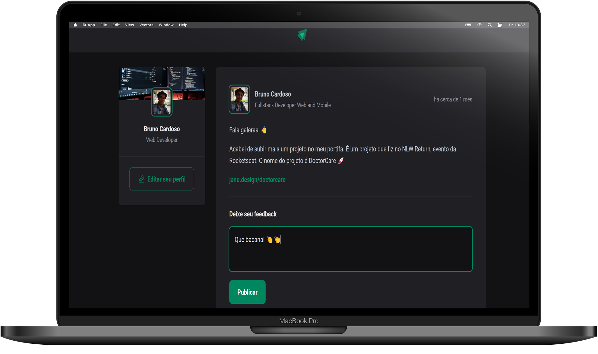

<h1 align="center">
  
</h1>

<h3 align="center">
  ReactJS / Typescript Application Social Feed project by Bootcamp Ignite Rocketseat
</h3>

<p align="center">Post, Comment, Like</p>

<p align="center">
  <a href="#%EF%B8%8F-about-the-project">About the project</a>&nbsp;&nbsp;&nbsp;|&nbsp;&nbsp;&nbsp;
  <a href="#-technologies">Technologies</a>&nbsp;&nbsp;&nbsp;|&nbsp;&nbsp;&nbsp;
  <a href="#-getting-started">Getting started</a>&nbsp;&nbsp;&nbsp;|&nbsp;&nbsp;&nbsp;
  <a href="#-how-to-contribute">How to contribute</a>&nbsp;&nbsp;&nbsp;|&nbsp;&nbsp;&nbsp;
  <a href="#-license">License</a>
</p>

## 🛍️ About the project


Web aplication of Ignite Feed project - Design of a social media feed where the user can post, comment and react to a post - made with ReactJS, TypeScript, SASS, and Vite.

<h1 align="center">
  
</h1>


## 🚀 Technologies

Technologies that I used to develop this web client

- [ReactJS](https://reactjs.org/)
- [TypeScript](https://www.typescriptlang.org/)
- [Vite](https://vitejs.dev/)
- [SASS](https://sass-lang.com/) 


## 💻 Getting started

This project was bootstrapped with [npm create vite@latest](https://vitejs.dev/guide/).

### Requirements


**Clone the project and access the folder**

```bash
$ git clone https://github.com/bruno07dev/ignite-feed.git && cd ignite-feed
```

**Follow the steps below**

```bash
# Install the dependencies
$ npm i

# Runs the app in the development mode.\

$ npm run dev

Open [http://localhost:3001](http://localhost:3001) to view it in the browser.

# The page will reload if you make edits.\

# You will also see any lint errors in the console.


## 🤔 How to contribute

**Make a fork of this repository**

```bash
# Fork using GitHub official command line
# If you don't have the GitHub CLI, use the web site to do that.

$ gh repo fork bruno07dev/ignite-feed
```

**Follow the steps below**

```bash
# Clone your fork
$ git clone your-fork-url && cd ignite-feed

# Create a branch with your feature
$ git checkout -b my-feature

# Make the commit with your changes
$ git commit -m 'feat: My new feature'

# Send the code to your remote branch
$ git push origin my-feature
```

After your pull request is merged, you can delete your branch

## 📝 License

This project is licensed under the MIT License - see the [LICENSE](LICENSE) file for details.

---

> Status Project: Project in development :heavy_check_mark:
# 🎬 Desenvolvedor

[ <br> <sub> Bruno Cardoso </sub>](https://www.linkedin.com/in/bruno-s-cardoso/) |
| :---: |

Made with 💜 by Bruno Cardoso 👋